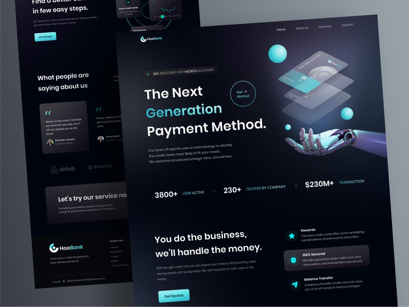

<h1 align="center"> HooBank - Bank Modern App </h1>

> Check the live demo in: [HooBank - Bank Modern App](https://bank-modern-app-gustavohdab.vercel.app/)

  <a href="#-tecnologias">Tecnologias</a>&nbsp;&nbsp;&nbsp;|&nbsp;&nbsp;&nbsp;
  <a href="#-projeto">Projeto</a>&nbsp;&nbsp;&nbsp;&nbsp;&nbsp;&nbsp;</a>

 

  Preview

  

  Mobile preview

    <table>
	    <tr>
    	    <td style="padding:10px">
        	    
      	    </td>
            <td style="padding:10px">
            	
            </td>
        </tr>
    </table>

## 🚀 Tecnologias

Esse projeto foi desenvolvido com as seguintes tecnologias:

- [JavaScript](https://www.javascript.com/)
- [React](https://reactjs.org/)
- [Tailwind.css](https://tailwindcss.com/)
- [Git](https://git-scm.com/)
- [GitHub](https://github.com/)

## 💻 Projeto

O HooBank é um projeto de um banco moderno, com um design simples e clean, com um layout responsivo para web e mobile. O projeto foi desenvolvido com o intuito de praticar e aperfeiçoar meus conhecimentos em React, JS e Tailwind.CSS, além de praticar o uso de componentes e constantes. O projeto foi desenvolvido com base no layout do [Figma](<https://www.figma.com/file/I1NX5JmJ

---

Feito com ♥ by Gustavo Batista :wave: [LinkedIn](https://www.linkedin.com/in/gustavo-h-batista/) e [GitHub](https://github.com/gustavohdab)

> > [Presentation Video] Extra

https://user-images.githubusercontent.com/112674398/204117070-f038cd9e-85d5-4792-8372-ff54f2cbfebc.mp4
